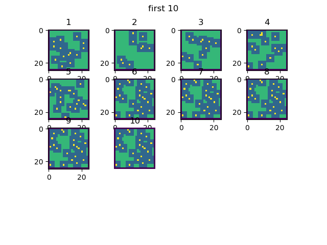
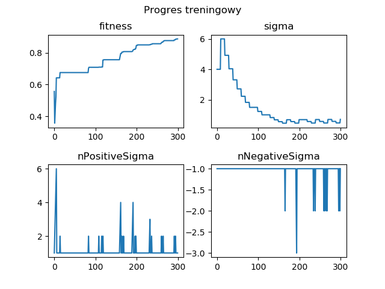
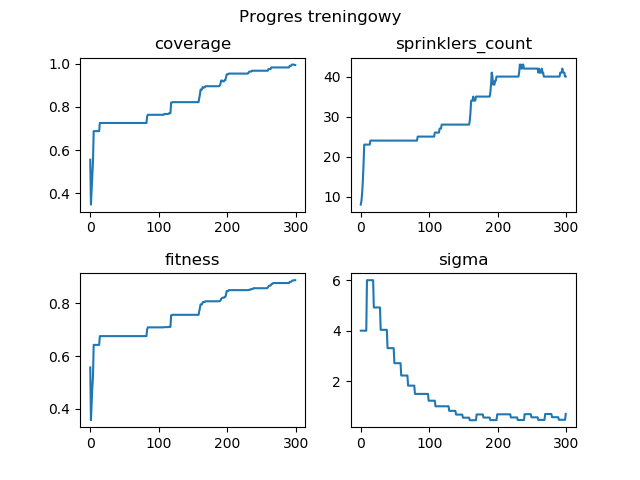
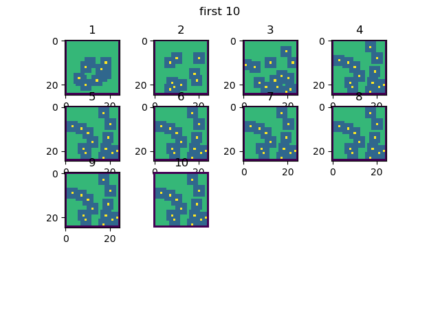
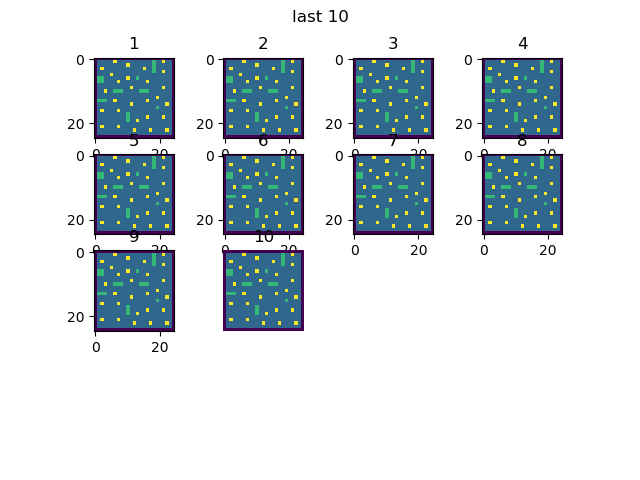
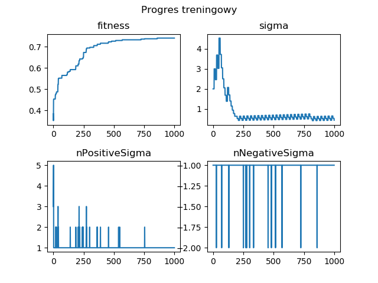

# Wykorzystanie algorytmów ewolucyjnych w bezpieczeństwie budynków
## Treść zadania
Napisać program dokonujący optymalnego rozkładu tryskaczy na danym obszarze zamkniętym w przestrzeni dyskretnej. 
Tryskacz zapewnia pokrycie obszaru ‘kołowego’ o średnicy D i jego zasięg może być ograniczony przez ściany. 
Tryskacze mogą być umieszczane tylko w punktach wewnętrznych obszaru. Przedmiotem minimalizacji jest liczba tryskaczy. 
WE: plik z mapą/definicją obszaru, średnica D, minimalne pokrycie w % do zakończenia działania algorytmu. 
WY: położenie tryskaczy oraz uzyskany % pokrycia.

## Wymagania wstępne
Program jest kompatybilny z Python 3.6.
Wykorzystano następujące biblioteki:
```python
numpy
json
numpy
skimage
matplotlib
random 
math
argparse
copy
collections
```
## Mapy
Mapy zdefiniowano w formie plików json. Mapy są uszeregowano według zasady: 0 - najprostsza N- najbardziej skomplikowna
## Rozpatrywane algorytmy
Rozpatrywano i zaimplementowano dwa typy algorytmów ewolucyjnych:
* algorytm (1+1)
Pełna wersja algorytmu (1+1) została zdefiniowana w pliku [main](./main.py)
* algorytm (μ, λ)

## Zdefiniowane struktury
W pliku [main](./main.py) zdefiniowano następujące struktury:
```python
class Sprinkler
Klasa ta definiuje pojedyńczy tryskacz
```
```python
class Point
Definiuje pojedyńczy punkt ma mapie. Ma 4 kluczowe atrybuty:
is_sprinkler - w punkcie znajduje się tryskacz
self.is_wet -  punkt jest w zasięgu tryskacza
self.is_waterable - w punkcie może się znajdować tryskacz
self.is_wall - w punkcie jest ściana (obszar niedostępny)
```
```python 
class Individual
Klasa ta definiuje osobnika. Pojedyńczy osobnik to zbiór tryskaczy. Zadaniem algorytmu jest znalezienie najlepszego osobnika w procesie ewolucji (Problem sprowadza się więc do znalezienia optymalnego rozłożenia tryskaczy).
```
```python 
class ActualMap
Klasa definiuje mapę. Jest to główna klasa w programie, która organizuje działanie algorytmu.
```
Zdefiniowano w niej kilka kluczowych atrybutów:
```python
self.mapRaw - przechowuje czystą mapę  w postaci znaków ASCII bez osobnika
self.mapPointsOrigin, self.mapPoints - przechowuje mapę definiowaną jako zbiór obiektów typu Points
self.mapDrawableOrigin, self.mapDrawable - przechowuje mapę w postaci przystosowanej do wyświetlania przez matplotlib 
``` 
## Uruchomienie algorytmu
Algorytm wywoluje się z przykładowymi argumentami:
```sh
python main.py ./maps/map0.json 3 10 10 0.2
```
 z wykorzystaniem parsowania argumentów.
```sh
positional arguments:
  map                   Source path with map of ascii chars
  radius                radius of single sprinkler field
  iterations            Number of iterations in trening
  initSprinklersNr      Number of sprinklers in first population
  a                     Parameter of fitness funcion in range <0,1>

optional arguments:
  -h, --help            show this help message and exit
  --sigma SIGMA         Defines random disturbance from normal distribution of
                        the childs position. As default 2
  --nSigma NSIGMA       Defines random disturbance from normal distribution of
                        childs ammount of sprinklers. As default 2
  --c1 C1               Parameter of (1+1) function. As default 1.2
  --c2 C2               Parameter of (1+1) function. As default 1.2
  --historyMax          Length of list history, which keeps history of
                        changing and not changing parent to child
```
## Proces treningu
W celu prowadzenia treningu wykorzystuje się funkcję 
```python
def mutationNew(individual_parent, history, m, c1, c2, sigma, nSigma, iterationIndex, actualMap, a)
```
Funkcja ta przechwytuje kolejne osobniki, update'uje zaburzebia osobnika sigma & nSigma, tworzy nowego osbnika, wybiera lepszego i go ocenia.
Operracje te są powtarzane aż do osiągnięcia warunku końcowego.

## Funkcja przystosowania
Funckcja przystosowania została zdefiniowana jako:
```python
def getFitness(individual, currentMap, a)
```
Jest ona zdefiniowana równaniem: 

  

gdzie:


## Wyniki
Prezprowadzono szereg symulacji, w celu znalezienia optymalnej wartości parametrów i prezentacji działania algorytmu.

| Sim nr| Map  | Radius | Iters | InitSprinklers | Sigma | nPSigma | nNSigma | a   | histMax | c1   |c2   | maxInterNoChange   | FFitness| FSigma | Coverage | FSprinklers|
| ----- |:----:| ------:| -----:| --------------:| -----:| -------:| -------:| ---:| -------:| ----:| ---:| -----------------: |--------:| ------:| --------:| ----------:|
| f1    | map6 |    4   |  100  |      3         |   4   | 1       | -1      | 0.1 | 10      | 0.82 | 1.2 | (iterations * 0.3) |0.65     | 3.9    |          |            |
| f2    | map6 |    2   |  300  |      5         |   4   | 1       | -1      | 0.2 | 10      | 0.82 | 1.2 | (iterations * 0.3) |0.6      | 0.5    |          |            |
| f3    | map6 |    3   |  500  |      10        |   3   | 1       | -1      | 0.15| 10      | 0.82 | 1.2 | (iterations * 0.3) |0.72     | 0.2    |          |            |
| f4    | map6 |    3   |  1000 |      10        |   5   | 1       | -1      | 0.18| 10      | 0.82 | 1.2 | (iterations * 0.3) |0.68     | 0.5    |          |            |
| f5    | map6 |    3   |  1000 |      4         |   2   | 2       | -2      | 0.15| 10      | 0.82 | 1.5 | 50                 |0.73     | 0.3    |          |            |
| f7    
| f8    | map6 |    3   |  300  |      8         |   4   | 1       | -1      | 0.05| 10      | 0.82 | 1.5 | 100                |0.9      | 0.1    |  1       |     41     |
| f9    | map7 |    2   |  150  |      3         |   4   | 1       | -1      | 0.1 | 10      | 0.82 | 1.2 | 100                |0.48     | 0.1    |  0.51    |     32     |

Najlepsze wyniki osiągnięte na mapie 6 (symulacja 8) zaprezentowano poniżej:









Wyniki osągnięte na mapie 6 (symulacja 5) zostały zaprezentowane poniżej: 





